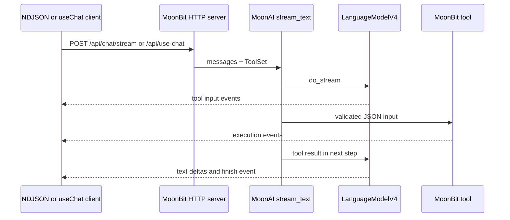

# MoonAI Web agent

This example is a complete browser agent backed by a native MoonBit HTTP
server. It uses the same `LanguageModelV4`, `stream_text`, `ToolSet`, and
multi-step execution contracts as a CLI or production service.

## Run

From the repository root:

```shell
moon run examples/web_agent/backend
```

Open <http://127.0.0.1:8080>. The default `demo` provider runs locally without
credentials. See [the examples guide](../README.md) for live provider setup.

The server also accepts:

| Variable | Default | Purpose |
| --- | --- | --- |
| `MOONAI_HOST` | `127.0.0.1` | HTTP listen address |
| `MOONAI_PORT` | `8080` | HTTP listen port |
| `MOONAI_FRONTEND_DIR` | Auto-detected | Directory containing `index.html`, `app.js`, and `styles.css` |

## Architecture



The browser never receives provider credentials. Conversation history is sent
to the backend as user and assistant messages, while system instructions are
owned by the server.

## HTTP API

### `GET /api/health`

Returns the active provider and model:

```json
{
  "status": "ok",
  "provider": "demo",
  "model": "moonai-demo",
  "demo": true
}
```

### `POST /api/chat`

Runs the buffered multi-step workflow. The request accepts a `prompt` shortcut
or message history:

```json
{
  "messages": [
    { "role": "user", "content": "Calculate 42 * 8." }
  ]
}
```

The response includes final text, reasoning, calls, results, step count, finish
reason, and total usage.

### `POST /api/chat/stream`

Accepts the same request and responds as `application/x-ndjson`. Each line is a
complete JSON event. Event types include:

| Event | Meaning |
| --- | --- |
| `metadata` | Active provider and model |
| `text-delta` | Generated answer text |
| `reasoning-delta` | Generated reasoning text |
| `tool-input-start` | Model started a tool call |
| `tool-input-delta` | Incremental tool arguments |
| `tool-input-end` | Tool arguments completed |
| `tool-call` | Parsed tool call is ready |
| `tool-execution-start` | MoonBit started executing a client tool |
| `tool-execution-result` | MoonBit tool returned output |
| `provider-tool-result` | Provider-executed tool returned output |
| `step-finish` | One model step completed |
| `finish` | Complete multi-step result and aggregate usage |
| `provider-error`, `error` | Stream or request failure |

Every line is flushed immediately, allowing any browser or native client to
render the agent lifecycle while it is running.

### `POST /api/use-chat`

Accepts the default `DefaultChatTransport` request body:

```json
{
  "id": "chat-1",
  "messages": [
    {
      "id": "user-1",
      "role": "user",
      "parts": [{ "type": "text", "text": "Calculate 42 * 8." }]
    }
  ],
  "trigger": "submit-message",
  "messageId": null
}
```

The response is Server-Sent Events with `Content-Type: text/event-stream` and
`x-vercel-ai-ui-message-stream: v1`. It emits the standard `start`,
`start-step`, text, reasoning, dynamic tool, `finish-step`, and `finish` chunks,
followed by `data: [DONE]`. Both submit and regenerate triggers are supported.

The [React client](../react_use_chat/README.md) consumes this route using the
normal `@ai-sdk/react` state machine.

## Frontend

The frontend lives in `frontend/` and uses browser-native APIs:

- streaming `fetch` with incremental NDJSON parsing;
- safe text rendering without HTML injection;
- conversation history capped before each request;
- abortable generation;
- provider, usage, and tool lifecycle state;
- responsive desktop and mobile layouts;
- keyboard focus, 44-pixel controls, and reduced-motion support.

No Node.js runtime is needed to run the default frontend. Its three assets are
also embedded into the native executable, with `MOONAI_FRONTEND_DIR` available
as an optional development override.

## Standalone build

From PowerShell at the repository root:

```powershell
.\examples\build_standalone.ps1
```

This regenerates `assets_generated.mbt`, performs a native release build, and
writes `dist/moonai-agent.exe`. The executable serves the complete frontend
even when launched outside the repository.
